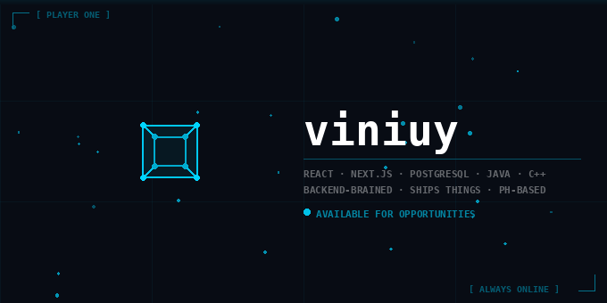

  

 

I'm a developer based in the Philippines who picks up skills fast and takes everything seriously. I stay physically active, I'm always listening to music, and I build things I actually care about — especially anything that automates the boring stuff.

 

---

## 🧠 Languages & Technologies

---

## 🏆 Achievements

| 🥇 | STI Tagisan ng Talino — Codefest | **Championship** |
|:---:|:---|:---|
| 🥈 | STI Tagisan ng Talino — Codefest | **1st Runner Up · Cluster** |

---

## 📊 Stats

---

